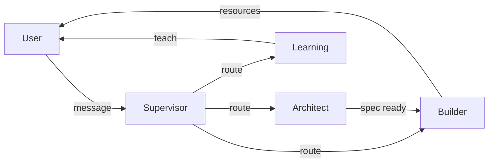

# Arcgentic

> Ask, Learn, Master.

Arcgentic is an open-source, multi-agent learning platform where AI agents research, teach, and create personalised learning content for any topic.

## What it does

- **Ask** anything — start a learning session on any topic or upload your own study materials (PDFs, URLs).
- **Learn** interactively — a tutor agent teaches you concept-by-concept with inline visualisations, diagrams, and interactive widgets.
- **Master** the material — the system generates a full curriculum pack: rich explanations, podcast scripts, presentations, flashcards, and concept roadmaps.

## Architecture

```
┌─────────────────────────────────────────────────────────────────┐
│                        Monorepo (Turborepo + pnpm)              │
├───────────────┬───────────────┬───────────────┬─────────────────┤
│   apps/web    │ apps/agent    │ apps/user     │   packages/*    │
│               │   _service    │   _service    │                 │
│  React 19     │  Flask +      │  Go + GraphQL │  @arcgentic/ui  │
│  Vite         │  LangGraph    │  Echo + SQLC  │  eslint-config  │
│  TanStack     │  Multi-agent  │  PostgreSQL   │  ts-config      │
│  Tailwind v4  │  orchestr.    │               │                 │
└───────────────┴───────────────┴───────────────┴─────────────────┘
```

### Agent Flow



- **Supervisor** — routes user messages to the right agent.
- **Architect** — gathers learning requirements through conversation.
- **Builder** — generates content resources (explanation, podcast, presentation, flashcards, roadmap).
- **Learning** — interactive tutor with widget rendering.

## Tech Stack

| Layer | Technology |
|-------|-----------|
| Frontend | React 19, Vite, TanStack Router/Query, Tailwind CSS v4, shadcn/ui |
| Agent Service | Python, Flask, LangGraph, LangChain, multi-provider LLM support |
| User Service | Go, Echo, gqlgen (GraphQL), SQLC, PostgreSQL |
| Infrastructure | Docker Compose, Turborepo, pnpm workspaces |

## Quick Start

### Prerequisites

- Node.js ≥ 18
- pnpm ≥ 10
- Python ≥ 3.11
- Go ≥ 1.21
- Docker (for PostgreSQL)

### Setup

```bash
# Clone and install
git clone <repo-url> && cd arcgentic
pnpm install

# Start the database
make db-up

# Run migrations
make migrate-up

# Copy env files
cp apps/agent_service/.env.example apps/agent_service/.env
cp apps/user_service/.env.example apps/user_service/.env

# Add at least one LLM API key to apps/agent_service/.env
# e.g. OPENAI_API_KEY=sk-...

# Start all services
pnpm dev
```

The app will be available at:
- **Web UI**: http://localhost:5173
- **Agent API**: http://localhost:5001
- **User API (GraphQL)**: http://localhost:8080

## Directory Structure

```
arcgentic/
├── apps/
│   ├── web/                 # React frontend
│   ├── agent_service/       # Python agent orchestration
│   └── user_service/        # Go user & session backend
├── packages/
│   ├── ui/                  # Shared UI component library
│   ├── eslint-config/       # Shared ESLint configuration
│   └── typescript-config/   # Shared TypeScript configuration
├── docs/                    # Project documentation
├── docker-compose.yml       # PostgreSQL dev database
├── turbo.json               # Turborepo pipeline config
└── Makefile                 # Development commands
```

## Development Commands

```bash
pnpm dev              # Start all services
pnpm build            # Build all apps
pnpm lint             # Lint all code
make db-up            # Start PostgreSQL
make db-down          # Stop PostgreSQL
make migrate-up       # Run migrations
make migrate-down     # Rollback last migration
```

See [docs/getting-started.md](docs/getting-started.md) for detailed setup instructions.

## Documentation

- [Architecture Overview](docs/architecture.md)
- [Getting Started](docs/getting-started.md)
- [Contributing](docs/contributing.md)

## License

MIT
