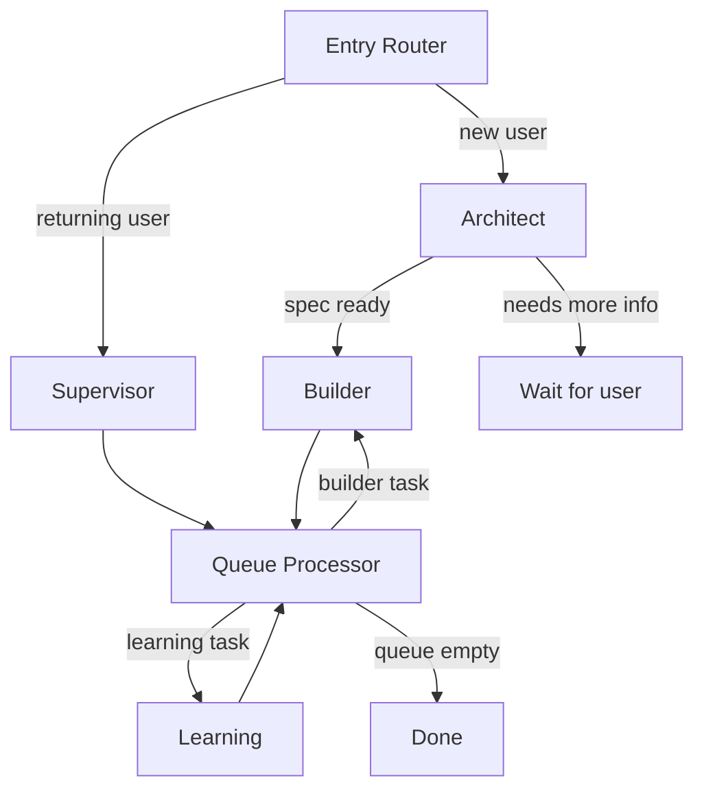

# Arcgentic Agent Service

Multi-agent orchestration service for learning content generation and interactive tutoring.

## Architecture

Built with Flask and LangGraph, the service runs a multi-agent graph:



### Agents

| Agent | Role |
|-------|------|
| **Supervisor** | Routes user messages to the correct downstream agent |
| **Architect** | Gathers learning requirements through conversational Q&A |
| **Builder** | Generates content resources (explanation, podcast, presentation, flashcards, roadmap) |
| **Learning** | Interactive tutor with inline widget rendering |

## Project Structure

```
agent_service/
├── app.py                    # Flask entrypoint
├── config.py                 # App factory, env loading, graph singleton
├── routes/                   # API route blueprints
│   ├── health.py             # GET /api/health
│   ├── chat.py               # POST /api/sessions/<id>/chat (SSE)
│   ├── sessions.py           # GET/POST session state and sources
│   └── resources.py          # GET generated resources
├── middleware/
│   └── request_parser.py     # Multipart/JSON request parsing
├── utils/
│   ├── sse.py                # SSE event formatting and async bridge
│   └── serializers.py        # State serialisation helpers
├── agent/
│   ├── graph.py              # Top-level LangGraph supervisor graph
│   ├── state.py              # AgentState TypedDict and reducers
│   ├── db.py                 # Postgres checkpointer setup
│   ├── model_provider.py     # Multi-provider LLM factory
│   ├── agents/               # Agent node implementations
│   │   ├── supervisor.py
│   │   ├── architect_graph.py
│   │   ├── builder_graph.py
│   │   └── learning.py
│   ├── tools/                # LangGraph tool definitions
│   │   ├── file_tools.py     # Content CRUD (read, write, edit, patch, ls, grep)
│   │   ├── task_tools.py     # Batch todo management (write_todos, update_todos)
│   │   ├── skill_tools.py    # Resource prompt retrieval (list_skills, get_skills)
│   │   ├── spec_tools.py     # Learning spec updates (update_spec)
│   │   └── learning_tools.py # Widget rendering (visualize_read_me, show_widget)
│   ├── prompts/              # Agent system prompts
│   │   ├── architect.py
│   │   ├── builder.py
│   │   ├── learning.py
│   │   └── supervisor.py
│   ├── skills/               # Skill modules
│   │   ├── builder/          # Resource generation prompt templates
│   │   └── learning/         # Widget documentation (.md files)
│   └── parsers/              # Input parsing (PDF, URL)
│       ├── pdf_parser.py
│       └── url_parser.py
└── requirements.txt
```

## API Endpoints

| Method | Path | Description |
|--------|------|-------------|
| `GET` | `/api/health` | Health check |
| `GET` | `/api/health/providers` | Configured LLM providers |
| `POST` | `/api/sessions/<id>/chat` | Send message, receive SSE stream |
| `GET` | `/api/sessions/<id>` | Get full session state |
| `POST` | `/api/sessions/<id>/sources` | Upload additional sources |
| `GET` | `/api/sessions/<id>/resources` | List all generated resources |
| `GET` | `/api/sessions/<id>/resources/<type>` | Get specific resource |

## Supported LLM Providers

- OpenAI (`OPENAI_API_KEY`)
- Anthropic (`ANTHROPIC_API_KEY`)
- Google AI (`GOOGLE_API_KEY`)
- OpenRouter (`OPENROUTER_API_KEY`)
- Ollama (`OLLAMA_BASE_URL`)
- LM Studio (`LMSTUDIO_BASE_URL`)

## Environment Variables

Copy `.env.example` to `.env`:

```bash
cp .env.example .env
```

Required:
- At least one LLM API key (e.g. `OPENAI_API_KEY`)

Optional:
- `DATABASE_URL` — PostgreSQL connection string (defaults to local Docker instance)

## Development

```bash
# Setup virtualenv and install deps
pnpm run setup

# Run the service
pnpm dev

# Or run directly
.venv/bin/python app.py
```

The service runs on `http://localhost:5001`.
