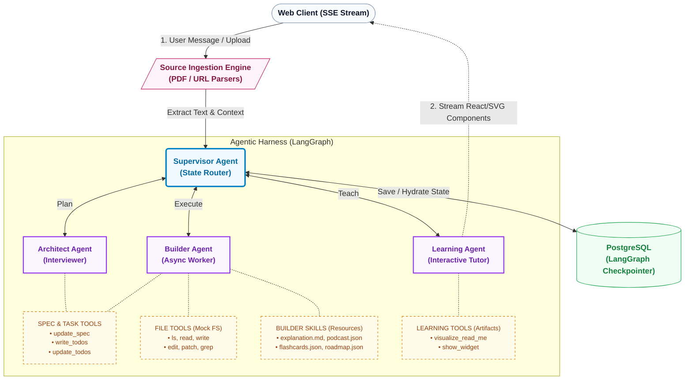

# Agentic Harness

The **Agentic Harness** is the intelligence layer of Arcgentic, located in `apps/agent_service`. It is a sophisticated multi-agent orchestration system built on top of LangGraph and LangChain.

Rather than a simple chatbot, the Harness operates as an autonomous worker pool. It seamlessly handles source ingestion, requirement gathering, asynchronous content generation, and interactive tutoring.

## Core Architecture

The Harness uses a **Supervisor-Worker** graph architecture. A central Supervisor node receives the user's input, evaluates the current state of the learning session, and routes the task to the appropriate specialized sub-agent.

---

## Source Ingestion Engine

Before the agents begin their work, Arcgentic can ingest vast amounts of custom context. When a user uploads a file or provides a link, the Go backend stores it, but the Python Agent Service actively parses it into the agent's memory.

| Parser | Capabilities | Purpose |
|---|---|---|
| **PDF Parser** | PyPDF | Extracts raw text from uploaded `.pdf` documents, structuring it for the LLM to read and cite. |
| **URL Parser** | Trafilatura / BeautifulSoup | Scrapes live web pages, extracting the main article content while stripping away navbars, ads, and noise. |

Once parsed, this context is attached to the LangGraph state. All subsequent agents (Architect, Builder, Learning) can read this material and cite it in their responses.

---

## The Agents

The system is composed of four primary agents, each constrained by a strict, specialized prompt and specific tool access.

### 1. Supervisor Agent (The Router)
The manager. It **never answers user queries directly**. Instead, it analyzes the conversation history and the active Task List to determine which worker agent should act next. It maintains momentum and ensures the curriculum is actively progressing.

### 2. Architect Agent (The Interviewer)
Triggered when a user provides a new topic, PDF, or URL. It acts as an interviewer, asking clarifying questions to understand exactly what the user wants to learn.
- **Goal**: Conversational requirements gathering.
- **Output**: Once the user answers its questions, it uses its tools to lock in a structured `LearningSpec` and a `TaskList` of resources that need to be generated.

### 3. Builder Agent (The Creator)
The asynchronous heavy-lifter.
- **Goal**: Autonomously work through the task list generated by the Architect.
- **Operation**: It runs in a background daemon thread, out of the user's critical path. It researches topics, writes long-form content, formats it, and saves it to the database as complete learning artifacts (Flashcards, Podcasts, Presentations).

### 4. Learning Agent (The Tutor)
The interactive guide.
- **Goal**: Provide an engaging, chat-based learning experience.
- **Operation**: It teaches concept-by-concept, answering follow-up questions, and keeping the user engaged.

---

## Tools & UI Skills

Agents interact with the system via distinct tool clusters. By restricting tools to specific agents, we prevent hallucinations and keep the agents laser-focused on their specific jobs.

### Agent Tools

> **Spec & Task Tools** ⸺ *Used by Architect and Builder*  
> `update_spec` \| `write_todos` \| `update_todos`  
> The Architect uses these to define curriculum objectives and maintain the stateful to-do list. The Builder uses them to read and update its progress.

> **Mock Filesystem (File Tools)** ⸺ *Used by Builder*  
> `ls` \| `read` \| `write` \| `edit` \| `patch` \| `grep`  
> A virtual scratchpad. The Builder uses these file operations to draft, edit, and review complex documents iteratively before committing them to the database.

> **Learning Tools (Artifacts)** ⸺ *Used by Learning Agent*  
> `visualize_read_me` \| `show_widget`  
> Inspired by Claude Artifacts, these tools allow the Tutor to break out of plain-text chat. Calling them tells the frontend to intercept the stream and render the payload as an interactive React or SVG component using specialized UI skills (e.g., `mockup`, `interactive`, `charts`).

### Skills (Knowledge Injection)

Skills are specialized rule-sets and prompts that teach the LLMs how to perform complex formatting. Agents access them via the `get_skills()` tool.

> **Builder Resource Skills**  
> `explanation.md` \| `podcast.json` \| `flashcards.json` \| `presentation.json` \| `roadmap.json`  
> Deeply detailed prompts that teach the Builder exactly how to structure, cite, and format rich learning materials.

> **Learning Agent UI Skills**  
> `ui_components.md` \| `charts.md` \| `diagram_types.md` \| `svg_setup.md` \| `mockup.md` \| `interactive.md` \| `art.md`  
> Instructions that teach the Learning Agent how to write code (React/Tailwind/Mermaid) that the frontend can render natively as interactive widgets.

---

## State Management & Data Flow

Because complex curricula generation takes time, the LangGraph orchestration must be deeply stateful, interruptible, and resilient.

1. **User Input**: A GraphQL mutation hits the Go User Service, creating a Message record.
2. **Trigger**: The frontend opens an SSE (Server-Sent Events) connection to the Python Agent Service.
3. **Graph Execution**: The Supervisor reads the thread state and routes to an agent.
4. **Streaming**: The agent streams chunks back to the frontend. If a UI tool or skill is called (e.g., streaming a `<Card>`), it is intercepted and streamed as an active UI block.
5. **Persistence**: LangGraph is configured with a **PostgreSQL Checkpointer**. Every state transition is saved. If a user refreshes the page or the server restarts, the graph hydrates from the database exactly where it left off.
