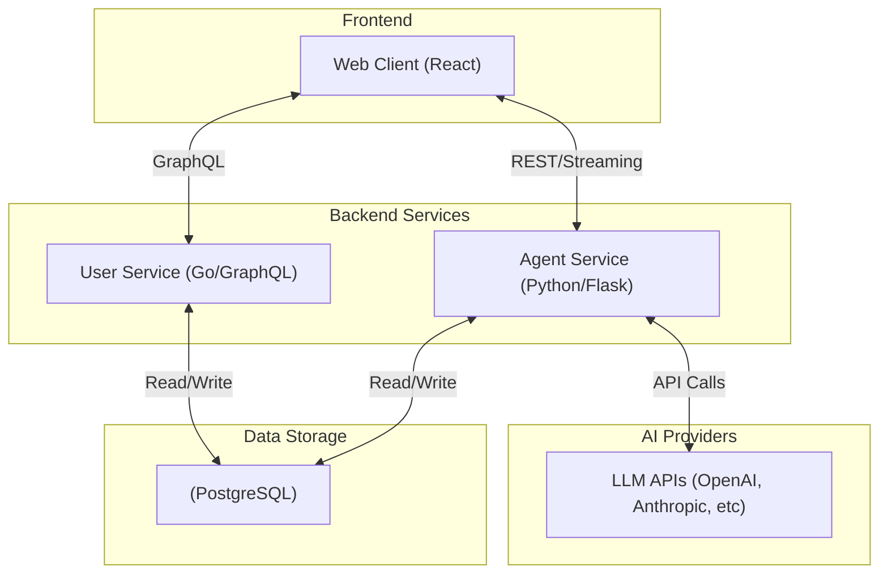
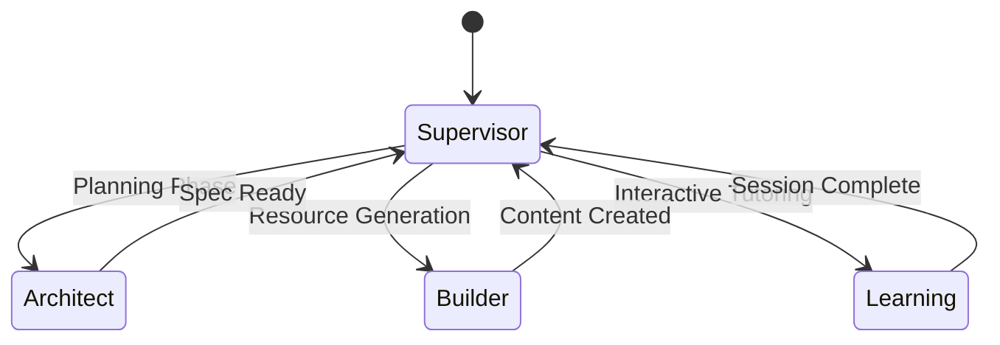

# Architecture Overview

Arcgentic is built as a highly modular, multi-service application inside a Turborepo monorepo. It cleanly separates the frontend application, the core user/session management backend, and the AI agent orchestration layer.

## System Architecture

## Monorepo Structure

We use Turborepo and pnpm workspaces to manage our multi-package repository.

- **`apps/web`**: The main user-facing application built with React 19 and Vite.
- **`apps/agent_service`**: A Python/Flask backend responsible for all AI interactions and workflows.
- **`apps/user_service`**: A Go/Echo HTTP server providing a GraphQL API for managing users, sessions, and chat history.
- **`packages/ui`**: A shared component library (`@arcgentic/ui`) built with Tailwind CSS v4 and shadcn/ui.
- **`packages/eslint-config`**: Shared ESLint rules for all TypeScript packages.
- **`packages/typescript-config`**: Shared `tsconfig.json` bases.

## Component Deep Dive

### 1. Web Application (`apps/web`)

The frontend is a Single Page Application (SPA) prioritizing performance and modern React patterns.

- **Framework**: React 19 + Vite
- **Routing**: `@tanstack/react-router` for type-safe routing.
- **Data Fetching**: `@tanstack/react-query` for server state management (GraphQL and REST).
- **Styling**: Tailwind CSS v4 with custom tokens and `shadcn/ui` based components.
- **State**: React Context for global UI state, URL search params for shareable view state.

### 2. User Service (`apps/user_service`)

A highly concurrent API gateway built in Go to handle core data models.

- **Framework**: Echo for HTTP routing.
- **API**: GraphQL via `gqlgen`, allowing the client to fetch exactly what it needs.
- **Database Access**: `sqlc` for type-safe, performant SQL queries.
- **Database**: PostgreSQL for persistent storage of Users, Sessions, and Messages.

### 3. Agent Service (`apps/agent_service`)

The brain of Arcgentic. It handles multi-agent orchestration to facilitate the "Ask, Learn, Master" loop.

- **Framework**: Flask (Python).
- **Core Orchestration**: `LangGraph` and `LangChain`.
- **Agents**:
  - **Supervisor**: Intelligently routes user queries to the appropriate sub-agent based on intent and phase.
  - **Architect**: Gathers requirements and scopes the learning objectives.
  - **Builder**: Autonomously researches and builds learning materials (presentations, podcasts, flashcards).
  - **Learning (Tutor)**: Handles the interactive chat, answering questions and teaching concept-by-concept.

#### Agent State Flow

## Deployment Model

All services are containerized via Docker. For production or local "full-stack" execution, `docker-compose` orchestrates the initialization and networking of the Web UI, Agent Service, User Service, and PostgreSQL database.
