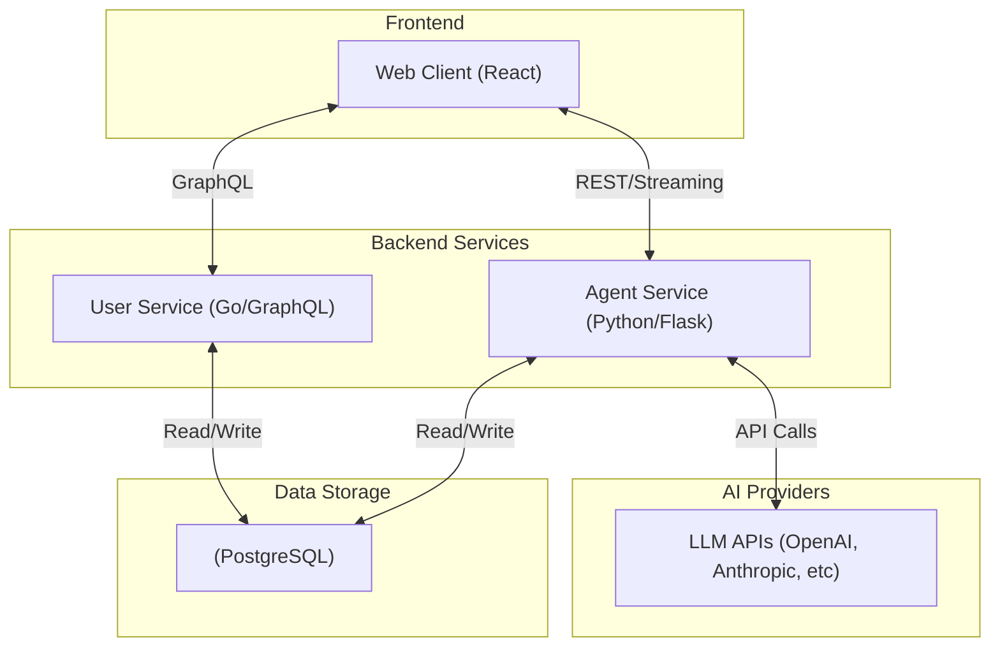

# Architecture Overview

Arcgentic is built as a highly modular, multi-service application inside a Turborepo monorepo. It cleanly separates the frontend application, the core user/session management backend, and the AI agent orchestration layer.

## System Architecture

## Monorepo Structure

We use **Turborepo** and **pnpm workspaces** for efficient monorepo management.

| Package | Type | Description |
|---|---|---|
| `apps/web` | React SPA | Main user-facing app (React 19, Vite, TanStack Router). |
| `apps/agent_service` | Python API | AI orchestration, tools, and LLM communication. |
| `apps/user_service` | Go API | Core backend for data models (users, sessions, history). |
| `apps/landing` | React SPA | Marketing and product showcase site. |
| `packages/ui` | Library | Shared component library (Tailwind v4, shadcn/ui). |
| `packages/eslint-config` | Config | Shared ESLint rules for TypeScript packages. |
| `packages/typescript-config` | Config | Shared `tsconfig.json` bases. |

## Service Deep Dive

### 1. Web Application (`apps/web`)

A fast, client-rendered Single Page Application built for a highly interactive AI chat experience.

* **Routing & State**: `TanStack Router` provides type-safe routing, while `TanStack Query` handles server state caching.
* **Component System**: Based on `shadcn/ui` and heavily customized with `Tailwind CSS v4` tokens.
* **Streaming UX**: Consumes Server-Sent Events (SSE) from the Agent Service to stream AI responses, UI artifacts, and tool execution states in real-time.

### 2. User Service (`apps/user_service`)

A high-concurrency API gateway built to handle reliable data persistence.

* **GraphQL API**: Built with `gqlgen`, allowing the frontend to flexibly query nested data (Users → Sessions → Messages).
* **Database Layer**: Uses `sqlc` to generate type-safe Go code directly from raw SQL queries, ensuring zero ORM overhead.
* **State Syncing**: Acts as the source of truth for chat history, ensuring the Python agent service can safely hydrate context across page reloads.

### 3. Agent Service (`apps/agent_service`)

The Python-based intelligence layer that powers Arcgentic's "Ask, Learn, Master" loop.

* **Architecture**: A multi-agent system built on top of `LangGraph`.
* **Stateful Workflows**: Uses PostgreSQL checkpointing to maintain persistent, interruptible graphs.
* **Deep Dive**: See the dedicated **[Agentic Harness](agent-harness.md)** documentation for a comprehensive breakdown of the Supervisor, Architect, Builder, Tools, and Memory systems.
